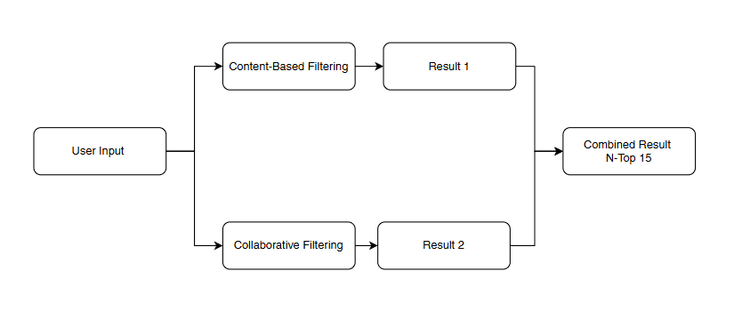
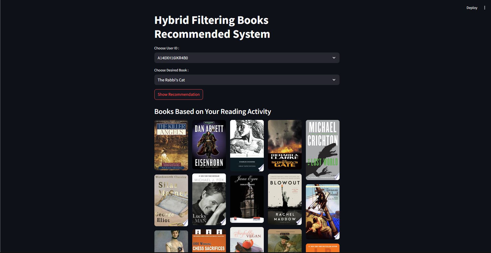

# HYBRID FILTERING BOOKS RECOMMENDATION SYSTEM



The Hybrid Filtering Books Recommendation System is an intelligent and scalable recommendation engine that combines both collaborative filtering and content-based filtering techniques to deliver more accurate and personalized book suggestions. Collaborative filtering analyzes user preferences and behavior to identify similar users and recommend books based on their ratings, while content-based filtering evaluates book features—such as titles, genres, and descriptions—to suggest items similar to those a user has liked before. By merging these approaches, the system effectively addresses the limitations of each individual method, such as the cold-start problem or lack of diversity, resulting in a more robust and user-centric recommendation experience.

Developed using Python, the system leverages libraries like Scikit-learn for machine learning tasks such as text vectorization (TfidfVectorizer) and similarity computation (pairwise_distances). Data handling is performed using Pandas and NumPy, ensuring efficient processing of user ratings and book metadata. The front end is built with Streamlit, offering an intuitive, interactive web application where users can search for books or receive personalized recommendations in real time. This hybrid model delivers a powerful demonstration of how blending collaborative and content-based methods can significantly improve recommendation quality in real-world applications.

## Project Goal

1. **Recomendation System**: Implementing hybrid filtering system by combining both collaborative and content-based filtering.
2. **Deliver Persoanlized Book Recommendations**: A core objective is to provide highly personalized suggestions by analyzing both individual user preferences (such as past ratings or book selections) and behavioral similarities with other users. By utilizing techniques like cosine similarity and TF-IDF vectorization.
3. **Build a Real-Time, User Friendly Web Application**: To make the recommendation system accessible and engaging, the project includes the development of a Streamlit-based web interface.

## Project Dataset
https://www.kaggle.com/datasets/mohamedbakhet/amazon-books-reviews?select=Books_rating.csv

## Tech Stack

- kagglehub
- pandas
- pyarrow
- scikit-learn
- nltk
- numpy
- streamlit

## Getting Started

`Cloninig repo`

```bash
git clone https://github.com/neinAlkem/hybrid-filtering-recommendation.git
```

`Create virtual envirovement (optional)`

```bash
python3 -m venv .env

source .env/Scripts/activate
```

`Install dependencies`

```bash
pip install -r requirements.txt
```

`Run streamlit`

```bash
streamlit run app.py
```

## Project Documentation

`Web app screenshoot`


